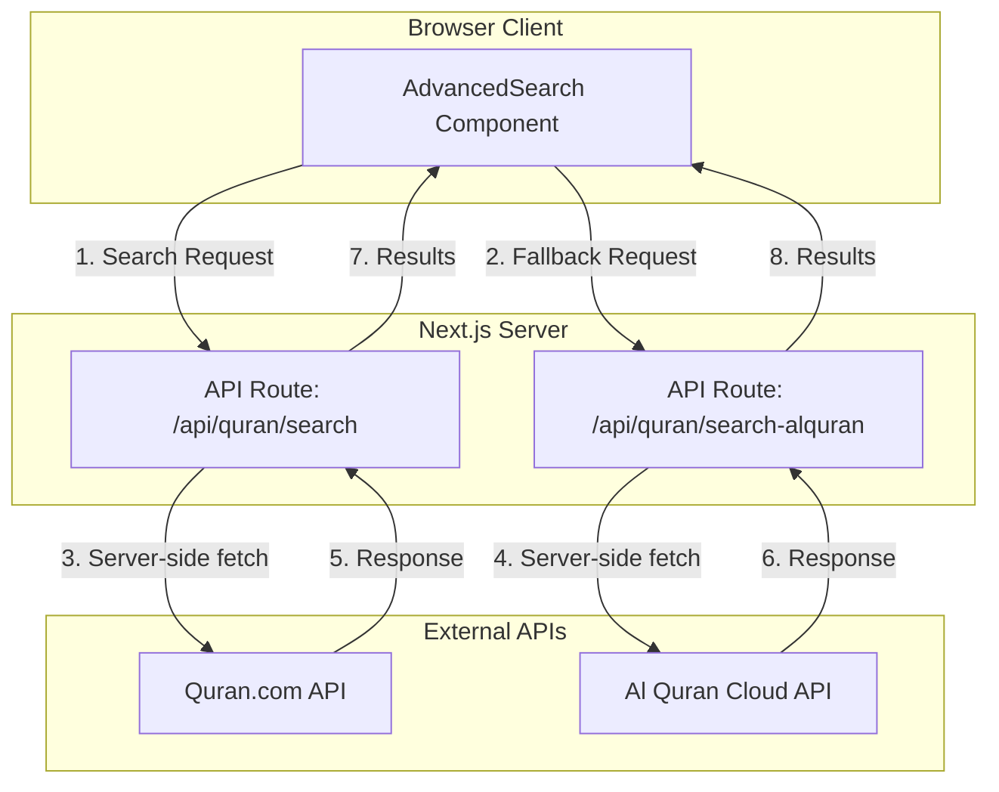

# Fix Search NetworkError - Implementation Plan

## Problem Analysis

### Error Description
- **Error Type**: Console TypeError
- **Error Message**: `NetworkError when attempting to fetch resource.`
- **Context**: Occurs when using the search functionality in the Mushaf (Quran) viewer
- **Next.js Version**: 16.1.6 (Turbopack)

### Root Cause
The search functionality makes direct client-side fetch requests to external APIs (Quran.com and Al Quran Cloud). This causes **CORS (Cross-Origin Resource Sharing) issues** because:

1. **Client-side fetch to external APIs**: The `AdvancedSearch` component is a client component (`"use client"`) that makes direct fetch calls to external APIs from the browser.

2. **CORS restrictions**: External APIs may not allow direct browser requests from your domain. When a fetch request is made from the browser to an external API, the browser enforces CORS rules. If the API doesn't include your domain in its `Access-Control-Allow-Origin` header, the browser blocks the request.

3. **No API proxy routes**: The application doesn't have Next.js API routes that could proxy requests to external APIs, which would bypass CORS restrictions.

### Current Search Flow
```
User types in search box
    ↓
AdvancedSearch component (client-side)
    ↓
searchQuranAdvanced() in api.ts
    ↓
searchWithFallback() in search-engine.ts
    ↓
Try 1: Quran.com API (client-side fetch) ❌ CORS Error
Try 2: Al Quran Cloud API (client-side fetch) ❌ CORS Error
Try 3: Local search (works, but requires data loading)
```

## Solution: Create API Routes to Proxy External API Requests

### Overview
Create Next.js API routes that act as a proxy between the client and external APIs. This way:
- The client calls your own API route (same origin, no CORS issues)
- Your API route calls the external API (server-side, no CORS restrictions)
- Results are returned to the client

### Architecture Diagram



## Implementation Steps

### Step 1: Create API Route for Quran.com Search
**File**: `src/app/api/quran/search/route.ts`

Create a Next.js API route that proxies search requests to Quran.com API:

```typescript
import { NextRequest, NextResponse } from 'next/server';

export async function GET(request: NextRequest) {
  const searchParams = request.nextUrl.searchParams;
  const query = searchParams.get('q');
  const language = searchParams.get('language') || 'ar';
  const page = searchParams.get('page') || '1';

  if (!query) {
    return NextResponse.json(
      { error: 'Query parameter is required' },
      { status: 400 }
    );
  }

  try {
    const params = new URLSearchParams({
      q: query,
      size: '20',
      page,
      language,
    });

    const response = await fetch(
      `https://api.quran.com/api/v4/search?${params}`,
      {
        next: { revalidate: 3600 },
      }
    );

    if (!response.ok) {
      throw new Error(`Quran.com API failed: ${response.status}`);
    }

    const data = await response.json();
    return NextResponse.json(data);
  } catch (error) {
    console.error('Error proxying search to Quran.com:', error);
    return NextResponse.json(
      { error: 'Failed to fetch search results' },
      { status: 500 }
    );
  }
}
```

### Step 2: Create API Route for Al Quran Cloud Search
**File**: `src/app/api/quran/search-alquran/route.ts`

Create a Next.js API route that proxies search requests to Al Quran Cloud API:

```typescript
import { NextRequest, NextResponse } from 'next/server';

export async function GET(request: NextRequest) {
  const searchParams = request.nextUrl.searchParams;
  const query = searchParams.get('q');
  const language = searchParams.get('language') || 'ar';
  const size = searchParams.get('size') || '50';
  const page = searchParams.get('page') || '1';

  if (!query) {
    return NextResponse.json(
      { error: 'Query parameter is required' },
      { status: 400 }
    );
  }

  try {
    const url = new URL(`https://alquran.cloud/api/v1/search/${encodeURIComponent(query.trim())}/all`);
    url.searchParams.append('language', language);

    const response = await fetch(url.toString());

    if (!response.ok) {
      throw new Error(`Al Quran Cloud API failed: ${response.status}`);
    }

    const data = await response.json();
    return NextResponse.json(data);
  } catch (error) {
    console.error('Error proxying search to Al Quran Cloud:', error);
    return NextResponse.json(
      { error: 'Failed to fetch search results' },
      { status: 500 }
    );
  }
}
```

### Step 3: Create API Route for Al Quran Cloud Chapter Search
**File**: `src/app/api/quran/search-alquran-chapter/route.ts`

Create an API route for searching within a specific chapter:

```typescript
import { NextRequest, NextResponse } from 'next/server';

export async function GET(request: NextRequest) {
  const searchParams = request.nextUrl.searchParams;
  const chapterId = searchParams.get('chapterId');
  const query = searchParams.get('q');
  const language = searchParams.get('language') || 'ar';
  const size = searchParams.get('size') || '50';

  if (!chapterId || !query) {
    return NextResponse.json(
      { error: 'chapterId and query parameters are required' },
      { status: 400 }
    );
  }

  try {
    // Get all verses in the chapter
    const url = new URL(`https://alquran.cloud/api/v1/surah/${chapterId}`);
    url.searchParams.append('language', language);

    const response = await fetch(url.toString());

    if (!response.ok) {
      throw new Error(`Al Quran Cloud API failed: ${response.status}`);
    }

    const data = await response.json();
    const verses = data.data?.ayahs || [];

    // Filter verses that contain the query
    const normalizedQuery = query.trim().toLowerCase();
    const matchingVerses = verses.filter((verse: any) =>
      verse.text.toLowerCase().includes(normalizedQuery)
    );

    // Limit results
    const limitedResults = matchingVerses.slice(0, parseInt(size));

    return NextResponse.json({
      results: limitedResults,
      totalResults: matchingVerses.length,
    });
  } catch (error) {
    console.error('Error searching in chapter with Al Quran Cloud:', error);
    return NextResponse.json(
      { error: 'Failed to fetch search results' },
      { status: 500 }
    );
  }
}
```

### Step 4: Update API Functions to Use Internal API Routes
**File**: `src/lib/quran/api-quran-com.ts`

Update the fetch function to use the internal API route:

```typescript
import { SearchResult } from "./api";

// Use internal API route instead of direct external API call
export async function fetchQuranComSearch(
    query: string,
    language: string = "ar",
    page: number = 1
): Promise<SearchResult> {
    const params = new URLSearchParams({
        q: query,
        language,
        page: page.toString(),
    });

    const res = await fetch(`/api/quran/search?${params}`);

    if (!res.ok) throw new Error("Failed to fetch search results");
    const data = await res.json();
    return data;
}
```

### Step 5: Update Al Quran Cloud API Functions
**File**: `src/lib/quran/api-alquran.ts`

Update the search functions to use internal API routes:

```typescript
import type { UnifiedSearchResult } from './api';

export async function searchAlQuranCloud(options: {
  query: string;
  language?: string;
  size?: number;
  page?: number;
}): Promise<{
  results: UnifiedSearchResult[];
  totalResults: number;
  currentPage: number;
  totalPages: number;
}> {
  const { query, language = 'ar', size = 50, page = 1 } = options;

  if (!query || query.trim().length < 2) {
    return {
      results: [],
      totalResults: 0,
      currentPage: 1,
      totalPages: 1,
    };
  }

  try {
    const params = new URLSearchParams({
      q: query,
      language,
      size: size.toString(),
      page: page.toString(),
    });

    const res = await fetch(`/api/quran/search-alquran?${params}`);

    if (!res.ok) {
      throw new Error(`Al Quran Cloud API failed: ${res.status}`);
    }

    const data: AlQuranSearchResponse = await res.json();

    // ... rest of the function remains the same
  } catch (error) {
    console.error('Error searching with Al Quran Cloud:', error);
    throw error;
  }
}

export async function searchAlQuranCloudInChapter(options: {
  chapterId: number;
  query: string;
  language?: string;
  size?: number;
}): Promise<{
  results: UnifiedSearchResult[];
  totalResults: number;
}> {
  const { chapterId, query, language = 'ar', size = 50 } = options;

  if (!query || query.trim().length < 2) {
    return {
      results: [],
      totalResults: 0,
    };
  }

  try {
    const params = new URLSearchParams({
      chapterId: chapterId.toString(),
      q: query,
      language,
      size: size.toString(),
    });

    const res = await fetch(`/api/quran/search-alquran-chapter?${params}`);

    if (!res.ok) {
      throw new Error(`Al Quran Cloud API failed: ${res.status}`);
    }

    const data = await res.json();

    // ... rest of the function remains the same
  } catch (error) {
    console.error('Error searching in chapter with Al Quran Cloud:', error);
    throw error;
  }
}
```

### Step 6: Remove Next.js Fetch Options from Client-Side Calls
**File**: `src/lib/quran/api-quran-com.ts`

Remove the `next: { revalidate: 3600 }` option since it's only valid for server-side fetch:

```typescript
// Before
const res = await fetch(`${BASE_URL}/search?${params}`, {
  next: { revalidate: 3600 },
});

// After (using internal API route)
const res = await fetch(`/api/quran/search?${params}`);
```

### Step 7: Add Error Handling and User Feedback
**File**: `src/components/mushaf/AdvancedSearch.tsx`

Improve error handling to show meaningful messages to users:

```typescript
const handleSearch = async (page: number = 1) => {
  if (!query.trim()) {
    setResults([]);
    setProgressMessage("");
    setProgressPercent(0);
    return;
  }

  setLoading(true);
  setProgressMessage("");
  setProgressPercent(0);

  try {
    // ... existing code
  } catch (error) {
    console.error("Search failed:", error);
    setResults([]);
    setTotalResults(0);
    setSearchSource(null);

    // Show user-friendly error message
    const errorMessage = locale === 'ar'
      ? 'حدث خطأ أثناء البحث. يرجى المحاولة مرة أخرى.'
      : 'An error occurred while searching. Please try again.';

    // You could use a toast notification here
    alert(errorMessage);
  } finally {
    setLoading(false);
    setProgressMessage("");
    setProgressPercent(0);
  }
};
```

### Step 8: Add Loading States for API Requests
**File**: `src/components/mushaf/AdvancedSearch.tsx`

Ensure loading states are properly displayed during API requests:

```typescript
// In the loading state, show which API is being tried
{loading && (
  <div className="flex flex-col justify-center items-center p-8 gap-3">
    <div className="w-6 h-6 border-2 border-primary border-t-transparent rounded-full animate-spin" />
    {progressMessage && (
      <div className="text-sm text-muted-foreground">
        {progressMessage}
      </div>
    )}
    {progressPercent > 0 && (
      <div className="w-full max-w-xs bg-muted rounded-full h-2">
        <div
          className="bg-primary h-2 rounded-full transition-all duration-300"
          style={{ width: `${progressPercent}%` }}
        />
      </div>
    )}
  </div>
)}
```

## Benefits of This Solution

1. **No CORS Issues**: API routes run server-side, so they can make requests to any external API without CORS restrictions.

2. **Better Error Handling**: Server-side API routes can handle errors more gracefully and provide better error messages.

3. **Caching**: Server-side API routes can implement caching strategies to reduce load on external APIs.

4. **Security**: API keys and sensitive configuration can be stored server-side, not exposed to the client.

5. **Rate Limiting Control**: You can implement rate limiting on your API routes to protect external APIs from abuse.

6. **Fallback Mechanism**: The existing fallback mechanism (Quran.com → Al Quran Cloud → Local) will still work, but now all API calls go through your own API routes.

## Testing Checklist

After implementation, verify:

- [ ] Search works without network errors
- [ ] Arabic search queries work correctly
- [ ] English search queries work correctly
- [ ] Search within specific surahs works
- [ ] Search within specific juz works
- [ ] Pagination works correctly
- [ ] Loading states display properly
- [ ] Error messages are user-friendly
- [ ] Fallback to local search works when external APIs fail
- [ ] Caching works as expected

## Alternative Solutions (Not Recommended)

### Option A: Use Server Components
Move the search logic to server components instead of client components. However, this would require significant refactoring of the UI.

### Option B: CORS Configuration
Configure CORS on the external APIs (not possible since you don't control Quran.com or Al Quran Cloud).

### Option C: Disable CORS in Browser
Not recommended for production and only works in development.

## Conclusion

The recommended solution is to create Next.js API routes that proxy requests to external APIs. This approach:
- Solves the CORS issue
- Maintains the existing search functionality
- Provides better error handling
- Is production-ready
- Follows Next.js best practices
