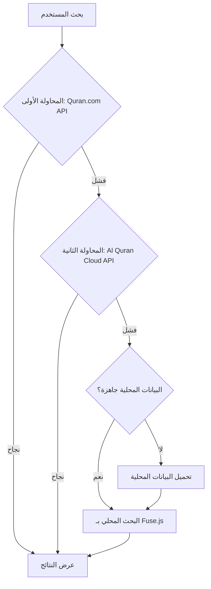

# خطة تنفيذ البحث الهجين في الآيات (Hybrid with Fallback)

## نظرة عامة

هذه الخطة تنفذ نظام بحث هجين يجمع بين:
- البحث عبر APIs خارجية (Quran.com و Al Quran Cloud)
- البحث المحلي كـ backup (يعمل دائماً)

---

## المعمارية



---

## الملفات التي سيتم إنشاؤها/تعديلها

### ملفات جديدة
1. `src/lib/quran/search-engine.ts` - محرك البحث الرئيسي
2. `src/lib/quran/local-search.ts` - البحث المحلي
3. `src/lib/quran/verse-index.ts` - فهرس الآيات
4. `src/lib/quran/api-alquran.ts` - API Al Quran Cloud

### ملفات معدلة
1. `src/lib/quran/api.ts` - تحديث دوال البحث
2. `src/components/mushaf/AdvancedSearch.tsx` - استخدام محرك البحث الجديد

---

## خطوات التنفيذ

### المرحلة 1: إعداد البحث المحلي

#### 1.1 إنشاء فهرس الآيات المحلي
**الملف:** `src/lib/quran/verse-index.ts`

**المهام:**
- تحميل جميع الآيات من Quran.com API (مرة واحدة)
- تخزين الآيات في IndexedDB أو LocalStorage
- إنشاء هيكل بيانات محسن للبحث
- إضافة دعم للتحديث التلقائي

**الواجهات:**
```typescript
interface VerseIndex {
  verse_key: string;
  text_uthmani: string;
  text_imlaei: string;
  chapter_id: number;
  verse_number: number;
  page_number: number;
  juz_number: number;
}

interface IndexedVerses {
  verses: VerseIndex[];
  lastUpdated: number;
  version: string;
}
```

**الدوال الرئيسية:**
- `loadVerseIndex()` - تحميل الفهرس من التخزين المحلي
- `fetchAndCacheVerses()` - جلب الآيات من API وتخزينها
- `isIndexAvailable()` - التحقق من توفر الفهرس
- `clearVerseIndex()` - مسح الفهرس (للاختبار)

---

#### 1.2 إنشاء البحث المحلي
**الملف:** `src/lib/quran/local-search.ts`

**المهام:**
- تثبيت واستخدام Fuse.js للبحث الذكي
- إعداد خيارات البحث (fuzzy matching, threshold)
- تطبيق الفلاتر (سورة، جزء)
- ترتيب النتائج حسب الصلة

**الواجهات:**
```typescript
interface LocalSearchOptions {
  query: string;
  chapterId?: number;
  juzNumber?: number;
  limit?: number;
}

interface LocalSearchResult {
  verse_key: string;
  text: string;
  highlighted: string;
  score: number;
  chapter_id: number;
  verse_number: number;
  page_number: number;
  juz_number: number;
}
```

**الدوال الرئيسية:**
- `searchVersesLocally()` - البحث في الفهرس المحلي
- `highlightMatch()` - تمييز النص المطابق
- `applyFilters()` - تطبيق فلاتر السورة والجزء

---

### المرحلة 2: إضافة API بديل

#### 2.1 إنشاء API Al Quran Cloud
**الملف:** `src/lib/quran/api-alquran.ts`

**المهام:**
- تنفيذ دوال البحث باستخدام Al Quran Cloud API
- تحويل النتائج إلى صيغة موحدة
- معالجة الأخطاء

**الواجهات:**
```typescript
interface AlQuranSearchResult {
  match: {
    number: number;
    text: string;
    edition: string;
  };
  surah: {
    number: number;
    name: string;
    englishName: string;
    englishNameTranslation: string;
    revelationType: string;
    numberOfAyahs: number;
  };
  numberInSurah: number;
}
```

**الدوال الرئيسية:**
- `searchAlQuranCloud()` - البحث عبر Al Quran Cloud API
- `convertToUnifiedResult()` - تحويل النتائج إلى صيغة موحدة

---

### المرحلة 3: إنشاء محرك البحث الهجين

#### 3.1 إنشاء محرك البحث الرئيسي
**الملف:** `src/lib/quran/search-engine.ts`

**المهام:**
- تنفيذ منطق Fallback
- إدارة ترتيب المحاولات
- دمج النتائج من مصادر مختلفة
- تخزين النتائج مؤقتاً (caching)

**الواجهات:**
```typescript
interface SearchEngineOptions {
  query: string;
  language: string;
  page?: number;
  size?: number;
  chapterId?: number;
  juzNumber?: number;
}

interface SearchEngineResult {
  results: UnifiedSearchResult[];
  totalResults: number;
  currentPage: number;
  totalPages: number;
  source: 'quran-com' | 'alquran-cloud' | 'local';
}
```

**الدوال الرئيسية:**
- `searchWithFallback()` - البحث مع نظام Fallback
- `tryQuranComAPI()` - المحاولة الأولى: Quran.com
- `tryAlQuranCloudAPI()` - المحاولة الثانية: Al Quran Cloud
- `tryLocalSearch()` - المحاولة الأخيرة: البحث المحلي
- `mergeResults()` - دمج النتائج من مصادر مختلفة
- `cacheResults()` - تخزين النتائج مؤقتاً

---

### المرحلة 4: تحديث API الحالي

#### 4.1 تحديث دوال البحث في api.ts
**الملف:** `src/lib/quran/api.ts`

**التعديلات:**
- استبدال `searchQuran()` بنسخة تستخدم محرك البحث الهجين
- استبدال `searchQuranAdvanced()` بنسخة تستخدم محرك البحث الهجين
- الاحتفاظ بالواجهات القديمة للتوافق

**الدوال المعدلة:**
```typescript
// استبدال الدالة القديمة
export async function searchQuran(
  query: string,
  language: string = "ar",
  page: number = 1
): Promise<SearchResult> {
  return searchWithFallback({
    query,
    language,
    page,
    size: 20
  });
}

// استبدال الدالة المتقدمة
export async function searchQuranAdvanced(
  options: AdvancedSearchOptions
): Promise<{
  results: UnifiedSearchResult[];
  totalResults: number;
  currentPage: number;
  totalPages: number;
}> {
  return searchWithFallback(options);
}
```

---

### المرحلة 5: تحديث واجهة المستخدم

#### 5.1 تحديث AdvancedSearch.tsx
**الملف:** `src/components/mushaf/AdvancedSearch.tsx`

**التعديلات:**
- عرض مصدر النتائج (API أو محلي)
- إضافة مؤشر تحميل للبيانات المحلية
- تحسين رسائل الخطأ
- إضافة خيار لتحديث الفهرس المحلي

**الميزات الجديدة:**
- عرض "جاري تحميل الفهرس المحلي..." عند أول استخدام
- عرض مصدر النتائج: "من Quran.com" أو "من Al Quran Cloud" أو "بحث محلي"
- زر "تحديث الفهرس المحلي" في الإعدادات

---

## التفاصيل التقنية

### 1. IndexedDB Schema

```typescript
const DB_NAME = 'QuranSearchDB';
const DB_VERSION = 1;
const STORE_NAME = 'verses';

interface VerseRecord {
  id: string; // verse_key
  text_uthmani: string;
  text_imlaei: string;
  chapter_id: number;
  verse_number: number;
  page_number: number;
  juz_number: number;
}
```

### 2. Fuse.js Configuration

```typescript
const fuseOptions = {
  keys: [
    { name: 'text_uthmani', weight: 0.7 },
    { name: 'text_imlaei', weight: 0.3 }
  ],
  threshold: 0.4, // مستوى التساهل في المطابقة
  distance: 100,
  minMatchCharLength: 2,
  includeScore: true,
  includeMatches: true
};
```

### 3. خوارزمية Fallback

```typescript
async function searchWithFallback(options: SearchEngineOptions): Promise<SearchEngineResult> {
  // 1. المحاولة الأولى: Quran.com API
  try {
    const result = await tryQuranComAPI(options);
    if (result.results.length > 0) {
      return { ...result, source: 'quran-com' };
    }
  } catch (error) {
    console.warn('Quran.com API failed:', error);
  }

  // 2. المحاولة الثانية: Al Quran Cloud API
  try {
    const result = await tryAlQuranCloudAPI(options);
    if (result.results.length > 0) {
      return { ...result, source: 'alquran-cloud' };
    }
  } catch (error) {
    console.warn('Al Quran Cloud API failed:', error);
  }

  // 3. المحاولة الأخيرة: البحث المحلي
  if (await isIndexAvailable()) {
    const result = await tryLocalSearch(options);
    return { ...result, source: 'local' };
  } else {
    // تحميل الفهرس المحلي
    await fetchAndCacheVerses();
    const result = await tryLocalSearch(options);
    return { ...result, source: 'local' };
  }
}
```

---

## التبعيات الجديدة

```json
{
  "dependencies": {
    "fuse.js": "^7.0.0",
    "idb": "^8.0.0"
  }
}
```

---

## اختبار الخطة

### سيناريوهات الاختبار

1. **البحث العادي**
   - البحث عن كلمة شائعة (مثل "الرحمن")
   - التحقق من ظهور النتائج

2. **اختبار Fallback**
   - محاكاة فشل Quran.com API
   - التحقق من استخدام Al Quran Cloud
   - محاكاة فشل جميع APIs
   - التحقق من استخدام البحث المحلي

3. **الفلاتر**
   - البحث في سورة محددة
   - البحث في جزء محددة
   - التحقق من صحة النتائج

4. **الأداء**
   - قياس سرعة البحث المحلي
   - قياس سرعة البحث عبر API
   - اختبار مع استعلامات طويلة

5. **التخزين المحلي**
   - التحقق من تخزين الفهرس
   - التحقق من العمل بدون إنترنت
   - التحقق من تحديث الفهرس

---

## المزايا المتوقعة

✅ **الموثوقية:** يعمل دائماً حتى مع فشل جميع APIs  
✅ **السرعة:** البحث المحلي سريع جداً  
✅ **الأداء:** لا يستهلك bandwidth للبحثات المتكررة  
✅ **العمل بدون إنترنت:** البحث المحلي يعمل offline  
✅ **البحث الذكي:** Fuse.js يدعم الأخطاء الإملائية  
✅ **قابلية التوسع:** يمكن إضافة مصادر بحث أخرى بسهولة  

---

## التوقيت

- **المرحلة 1:** إنشاء البحث المحلي
- **المرحلة 2:** إضافة API بديل
- **المرحلة 3:** إنشاء محرك البحث الهجين
- **المرحلة 4:** تحديث API الحالي
- **المرحلة 5:** تحديث واجهة المستخدم
- **الاختبار:** اختبار جميع السيناريوهات

---

## الملاحظات

- حجم البيانات المحلية المتوقع: ~2-3 MB
- وقت التحميل الأولي للفهرس: ~10-30 ثانية (حسب السرعة)
- البحث المحلي: أقل من 100ms
- البحث عبر API: ~500-2000ms
