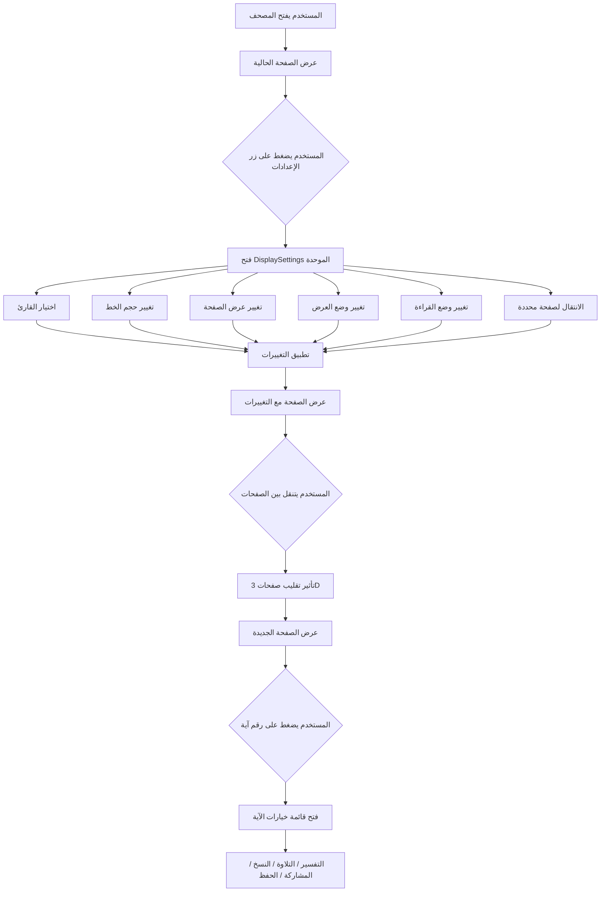

# خطة إصلاح وتحسينات المصحف التفاعلي
# Mushaf Fixes and Improvements Plan

## ملخص المشاكل المحددة (Identified Issues Summary)

### المشاكل الحرجة (Critical Issues)

1. **زر الإعدادات (Settings Button)**
   - المشكلة: تم تغيير وظيفة زر الإعدادات من فتح لوحة الإعدادات القديمة (التي تحتوي على اختيار القارئ والانتقال لصفحة) إلى فتح DisplaySettings فقط
   - النتيجة: فقدان الوصول إلى اختيار القارئ والانتقال المباشر للصفحة
   - الحل: دمج جميع الإعدادات في لوحة واحدة أو إضافة أزرار منفصلة

2. **إعدادات العرض لا تعمل (Display Settings Not Working)**
   - المشكلة: حجم الخط، عرض الصفحة، ووضع العرض (صفحة/صفحتين) لا يتم تطبيقها فعلياً على واجهة المستخدم
   - الحل: تطبيق الـ states على عناصر DOM الفعلية

3. **موقع نافذة الإعدادات (Settings Popup Positioning)**
   - المشكلة: نافذة DisplaySettings تظهر ناحية اليمين قليلاً بدلاً من منتصف الشاشة
   - الحل: إصلاح CSS positioning

4. **رقم الصفحة (Page Number Display)**
   - المشكلة: رقم الصفحة لا يظهر في الأعلى يسار، فقط يظهر في الشريط العلوي والسفلي
   - الحل: إضافة رقم الصفحة في أعلى يسار إطار الصفحة

5. **طرق التنقل (Navigation Methods)**
   - المشكلة: الأسهم على الجانبين والأزرار في الأسفل موجودة لكن قد لا تعمل بشكل صحيح
   - الحل: التحقق من وظائف التنقل وإصلاحها

6. **تأثير تقليب الصفحات (Page Flip Animation)**
   - المشكلة: لا يوجد تأثير تقليب صفحات كتاب ورقي، فقط تأثير fade بسيط
   - الحل: إضافة animation 3D مع transform: rotateY

---

## الخطة التفصيلية (Detailed Plan)

### المرحلة 1: إصلاحات حرجة (Critical Fixes)

#### 1.1 إعادة هيكلة نظام الإعدادات (Restructure Settings System)

**الهدف:** دمج جميع الإعدادات في لوحة واحدة متكاملة

**الملفات المعدلة:**
- [`src/components/mushaf/MushafViewer.tsx`](src/components/mushaf/MushafViewer.tsx)
- [`src/components/mushaf/DisplaySettings.tsx`](src/components/mushaf/DisplaySettings.tsx)

**التغييرات:**

**أ) في DisplaySettings.tsx:**
1. إضافة props جديدة للوظائف المفقودة:
   - `selectedReciter`, `setSelectedReciter` - لاختيار القارئ
   - `pageInput`, `setPageInput`, `goToPage` - للانتقال لصفحة محددة

2. إضافة أقسام جديدة في واجهة الإعدادات:
   - قسم اختيار القارئ (Reciter Selection)
   - قسم الانتقال لصفحة (Go to Page)

**ب) في MushafViewer.tsx:**
1. تمرير props جديدة لـ DisplaySettings:
   ```tsx
   <DisplaySettings
     // ... existing props
     selectedReciter={selectedReciter}
     setSelectedReciter={setSelectedReciter}
     pageInput={pageInput}
     setPageInput={setPageInput}
     goToPage={goToPage}
   />
   ```

2. إزالة لوحة الإعدادات القديمة (showSettings panel) لأن جميع الوظائف ستكون في DisplaySettings

#### 1.2 تطبيق إعدادات العرض (Apply Display Settings)

**الهدف:** جعل حجم الخط، عرض الصفحة، ووضع العرض تعمل فعلياً

**الملفات المعدلة:**
- [`src/components/mushaf/MushafViewer.tsx`](src/components/mushaf/MushafViewer.tsx)

**التغييرات:**

1. **تطبيق حجم الخط (Font Size):**
   - إضافة className ديناميكي لعنصر النص القرآني:
   ```tsx
   <div className={`quran-text text-center leading-[2.5] ${getFontSizeClass(fontSize)}`} dir="rtl">
   ```
   - إضافة دالة مساعدة:
   ```tsx
   const getFontSizeClass = (size: number) => {
     switch(size) {
       case 16: return 'text-lg';
       case 20: return 'text-xl';
       case 24: return 'text-2xl';
       case 28: return 'text-3xl';
       default: return 'text-xl';
     }
   };
   ```

2. **تطبيق عرض الصفحة (Page Width):**
   - إضافة className ديناميكي للحاوية الرئيسية:
   ```tsx
   <div className={`max-w-3xl mx-auto px-4 py-8 ${getPageWidthClass(pageWidth)}`}>
   ```
   - إضافة دالة مساعدة:
   ```tsx
   const getPageWidthClass = (width: string) => {
     switch(width) {
       case 'normal': return 'max-w-3xl';
       case 'wide': return 'max-w-5xl';
       case 'full': return 'max-w-full';
       default: return 'max-w-3xl';
     }
   };
   ```

3. **تطبيق وضع العرض (Display Mode - Single/Double):**
   - إضافة منطق لعرض صفحتين في وضع Double Page:
   ```tsx
   {displayMode === 'double' && currentPage % 2 === 1 ? (
     // Show current and next page side by side
   ) : (
     // Show single page
   )}
   ```

#### 1.3 إصلاح موقع نافذة الإعدادات (Fix Settings Popup Positioning)

**الملفات المعدلة:**
- [`src/components/mushaf/DisplaySettings.tsx`](src/components/mushaf/DisplaySettings.tsx)

**التغييرات:**

1. إصلاح className للـ motion.div:
   ```tsx
   className="fixed inset-0 flex items-center justify-center p-4"
   ```

2. إصلاح className للـ modal:
   ```tsx
   className="bg-card border border-border rounded-2xl shadow-2xl overflow-hidden max-w-md w-full mx-auto"
   ```

#### 1.4 إضافة رقم الصفحة في الأعلى يسار (Add Page Number Top-Left)

**الملفات المعدلة:**
- [`src/components/mushaf/MushafViewer.tsx`](src/components/mushaf/MushafViewer.tsx)

**التغييرات:**

1. إضافة رقم الصفحة في رأس إطار الصفحة:
   ```tsx
   <div className="flex items-center justify-between mb-6 pb-4 border-b border-border/50">
     <span className="text-xs text-muted-foreground font-medium">
       {t.mushaf.page} {currentPage}
     </span>
     <span className="text-xs text-muted-foreground">
       {t.mushaf.juz} {currentJuz}
     </span>
     <span className="text-xs text-muted-foreground">
       {t.mushaf.page} {currentPage}
     </span>
   </div>
   ```

#### 1.5 إصلاح تأثير تقليب الصفحات (Fix Page Flip Animation)

**الملفات المعدلة:**
- [`src/components/mushaf/MushafViewer.tsx`](src/components/mushaf/MushafViewer.tsx)

**التغييرات:**

1. إضافة CSS 3D transform للصفحة:
   ```tsx
   <motion.div
     key={currentPage}
     initial={{ opacity: 0, rotateY: -90 }}
     animate={{ opacity: 1, rotateY: 0 }}
     exit={{ opacity: 0, rotateY: 90 }}
     transition={{ duration: 0.5, type: "spring" }}
     style={{ transformStyle: "preserve-3d" }}
   >
   ```

2. إضافة CSS في globals.css للـ 3D effect:
   ```css
   .page-flip-container {
     perspective: 1500px;
   }
   .page-flip {
     transform-style: preserve-3d;
     backface-visibility: hidden;
   }
   ```

---

### المرحلة 2: تحسينات إضافية (Additional Improvements)

#### 2.1 إضافة وضع القراءة (Reading Mode)

**الهدف:** إضافة أوضاع قراءة مختلفة (عادي، بني، داكن)

**الملفات الجديدة:**
- [`src/components/mushaf/ReadingMode.tsx`](src/components/mushaf/ReadingMode.tsx)

**الملفات المعدلة:**
- [`src/components/mushaf/MushafViewer.tsx`](src/components/mushaf/MushafViewer.tsx)
- [`src/lib/i18n/translations.ts`](src/lib/i18n/translations.ts)

**التغييرات:**

1. إضافة state لوضع القراءة:
   ```tsx
   const [readingMode, setReadingMode] = useState<'normal' | 'sepia' | 'dark'>('normal');
   ```

2. تطبيق className حسب وضع القراءة على الحاوية الرئيسية:
   ```tsx
   <div className={`flex flex-col h-[calc(100vh-4rem)] ${getReadingModeClass(readingMode)}`}>
   ```

3. إضافة أزرار لتبديل أوضاع القراءة في DisplaySettings

#### 2.2 إضافة لوحة الإشارات المرجعية (Bookmarks Panel)

**الهدف:** عرض جميع الإشارات المرجعية المحفوظة

**الملفات الجديدة:**
- [`src/components/mushaf/BookmarksPanel.tsx`](src/components/mushaf/BookmarksPanel.tsx)

**الملفات المعدلة:**
- [`src/components/mushaf/MushafViewer.tsx`](src/components/mushaf/MushafViewer.tsx)

**التغييرات:**

1. إضافة state لعرض لوحة الإشارات المرجعية:
   ```tsx
   const [showBookmarks, setShowBookmarks] = useState(false);
   ```

2. إضافة زر لفتح لوحة الإشارات المرجعية في الشريط العلوي

3. إنشاء BookmarksPanel لعرض جميع الإشارات المرجعية المحفوظة

#### 2.3 إضافة شريط التقدم المرئي (Visual Progress Bar)

**الهدف:** عرض شريط تقدم مرئي في الأعلى

**الملفات المعدلة:**
- [`src/components/mushaf/MushafViewer.tsx`](src/components/mushaf/MushafViewer.tsx)

**التغييرات:**

1. إضافة شريط تقدم في أعلى الشاشة:
   ```tsx
   <div className="h-1 bg-muted">
     <div 
       className="h-full bg-primary transition-all duration-300"
       style={{ width: `${(currentPage / TOTAL_PAGES) * 100}%` }}
     />
   </div>
   ```

#### 2.4 إضافة اختصارات لوحة المفاتيح (Keyboard Shortcuts Help)

**الهدف:** عرض مساعدة باختصارات لوحة المفاتيح

**الملفات الجديدة:**
- [`src/components/mushaf/KeyboardShortcuts.tsx`](src/components/mushaf/KeyboardShortcuts.tsx)

**الملفات المعدلة:**
- [`src/components/mushaf/MushafViewer.tsx`](src/components/mushaf/MushafViewer.tsx)
- [`src/lib/i18n/translations.ts`](src/lib/i18n/translations.ts)

**التغييرات:**

1. إضافة state لعرض مساعدة الاختصارات:
   ```tsx
   const [showShortcuts, setShowShortcuts] = useState(false);
   ```

2. إضافة زر لفتح مساعدة الاختصارات

3. عرض قائمة الاختصارات:
   - ← / → : التنقل بين الصفحات
   - Space : تشغيل/إيقاف الصوت
   - Escape : إغلاق جميع النوافذ
   - F : بحث
   - ? : عرض الاختصارات

#### 2.5 إضافة قائمة سريعة للسور (Surah Quick Navigation)

**الهدف:** إضافة dropdown لاختيار السورة مباشرة

**الملفات المعدلة:**
- [`src/components/mushaf/MushafViewer.tsx`](src/components/mushaf/MushafViewer.tsx)

**التغييرات:**

1. إضافة dropdown في الشريط العلوي لاختيار السورة
2. عند اختيار سورة، الانتقال مباشرة لصفحتها

#### 2.6 إضافة Auto-Scroll (التمرير التلقائي)

**الهدف:** إضافة ميزة التمرير التلقائي للقراءة المستمرة

**الملفات المعدلة:**
- [`src/components/mushaf/MushafViewer.tsx`](src/components/mushaf/MushafViewer.tsx)

**التغييرات:**

1. إضافة state للتمرير التلقائي:
   ```tsx
   const [autoScroll, setAutoScroll] = useState(false);
   const [scrollSpeed, setScrollSpeed] = useState(1);
   ```

2. إضافة useEffect للتمرير التلقائي عند التفعيل

#### 2.7 تحسين الوصولية (Accessibility Improvements)

**الهدف:** تحسين الوصولية للمستخدمين ذوي الاحتياجات الخاصة

**الملفات المعدلة:**
- [`src/components/mushaf/MushafViewer.tsx`](src/components/mushaf/MushafViewer.tsx)

**التغييرات:**

1. إضافة ARIA labels لجميع الأزرار التفاعلية
2. دعم التنقل بلوحة المفاتيح بشكل كامل
3. تحسين contrast ratio للقراءة
4. إضافة focus indicators واضحة

---

### المرحلة 3: تحسينات واجهة المستخدم (UI/UX Improvements)

#### 3.1 تحسين التصميم المتجاوب (Responsive Design)

**الهدف:** تحسين التجربة على الأجهزة المختلفة

**التغييرات:**

1. تحسين حجم الخط على الشاشات الصغيرة
2. تحسين حجم الأزرار لللمس على الهواتف
3. تحسين عرض القوائم المنبثقة على الهواتف

#### 3.2 إضافة Loading States محسنة

**الهدف:** تحسين تجربة المستخدم أثناء التحميل

**التغييرات:**

1. إضافة skeleton loaders للصفحات
2. إضافة shimmer effects للنصوص
3. تحسين رسائل الخطأ

#### 3.3 تحسين Toast Notifications

**الهدف:** تحسين إشعارات المستخدم

**التغييرات:**

1. إضافة أيقونات للإشعارات
2. إضافة ألوان مختلفة حسب نوع الإشعار
3. تحسين موقع الإشعارات

---

## الملفات المطلوب تعديلها (Files to Modify)

### الملفات المعدلة (Modified Files)
1. [`src/components/mushaf/MushafViewer.tsx`](src/components/mushaf/MushafViewer.tsx) - الملف الرئيسي للمصحف
2. [`src/components/mushaf/DisplaySettings.tsx`](src/components/mushaf/DisplaySettings.tsx) - إعدادات العرض
3. [`src/lib/i18n/translations.ts`](src/lib/i18n/translations.ts) - الترجمات
4. [`src/app/globals.css`](src/app/globals.css) - الأنماط العامة

### الملفات الجديدة (New Files)
1. [`src/components/mushaf/ReadingMode.tsx`](src/components/mushaf/ReadingMode.tsx) - وضع القراءة
2. [`src/components/mushaf/BookmarksPanel.tsx`](src/components/mushaf/BookmarksPanel.tsx) - لوحة الإشارات المرجعية
3. [`src/components/mushaf/KeyboardShortcuts.tsx`](src/components/mushaf/KeyboardShortcuts.tsx) - اختصارات لوحة المفاتيح

---

## مخطط تدفق العمل (Workflow Diagram)



---

## التحقق (Verification Checklist)

### الإصلاحات الحرجة (Critical Fixes)
- [ ] زر الإعدادات يفتح لوحة موحدة تحتوي على جميع الخيارات
- [ ] حجم الخط يتغير عند اختيار أحجام مختلفة
- [ ] عرض الصفحة يتغير عند اختيار أوضاع مختلفة
- [ ] وضع صفحة/صفحتين يعمل بشكل صحيح
- [ ] نافذة الإعدادات تظهر في منتصف الشاشة
- [ ] رقم الصفحة يظهر في الأعلى يسار
- [ ] الأسهم على الجانبين تعمل للتنقل
- [ ] الأزرار في الأسفل تعمل للتنقل
- [ ] تأثير تقليب الصفحات يعمل بشكل سلس

### التحسينات الإضافية (Additional Improvements)
- [ ] وضع القراءة (عادي/بني/داكن) يعمل
- [ ] لوحة الإشارات المرجعية تعرض جميع الإشارات
- [ ] شريط التقدم يظهر في الأعلى
- [ ] مساعدة الاختصارات تعرض جميع الاختصارات
- [ ] قائمة السور السريعة تعمل
- [ ] التمرير التلقائي يعمل عند التفعيل
- [ ] الوصولية محسنة (ARIA labels, keyboard navigation)

---

## ملاحظات التطبيق (Implementation Notes)

### الأداء (Performance)
- استخدام React.memo للمكونات الثقيلة
- استخدام useCallback و useMemo للتحسين
- Lazy loading للصفحات
- Caching للبيانات

### التوافق (Compatibility)
- دعم جميع المتصفحات الحديثة
- دعم الأجهزة المحمولة والتابلت
- دعم RTL و LTR

### الأمان (Security)
- التحقق من صحة المدخلات
- استخدام HTTPS للاتصال بالـ APIs
- حماية localStorage

---

## الجدول الزمني (Timeline)

### المرحلة 1: الإصلاحات الحرجة
- 1.1 إعادة هيكلة نظام الإعدادات
- 1.2 تطبيق إعدادات العرض
- 1.3 إصلاح موقع نافذة الإعدادات
- 1.4 إضافة رقم الصفحة في الأعلى يسار
- 1.5 إصلاح تأثير تقليب الصفحات

### المرحلة 2: التحسينات الإضافية
- 2.1 إضافة وضع القراءة
- 2.2 إضافة لوحة الإشارات المرجعية
- 2.3 إضافة شريط التقدم المرئي
- 2.4 إضافة اختصارات لوحة المفاتيح
- 2.5 إضافة قائمة سريعة للسور
- 2.6 إضافة Auto-Scroll
- 2.7 تحسين الوصولية

### المرحلة 3: تحسينات واجهة المستخدم
- 3.1 تحسين التصميم المتجاوب
- 3.2 إضافة Loading States محسنة
- 3.3 تحسين Toast Notifications
