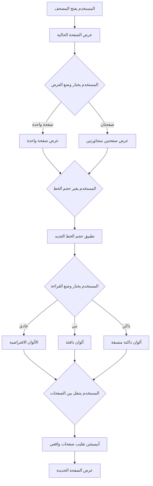

# خطة إصلاح المشاكل بناءً على ملاحظات المستخدم
# User Feedback Fixes Plan

## المشاكل المحددة (Identified Issues)

### 1. وضع الصفحتين لا يعمل (Double Page Mode Not Working)
**المشكلة:** displayMode state موجود لكن لا يوجد تطبيق فعلي لعرض صفحتين جنباً إلى جنب

**الحل المقترح:**
- إضافة منطق لعرض صفحتين متجاورتين في وضع Double Page
- عرض الصفحة الحالية والصفحة التالية (أو السابقة) جنباً إلى جنب
- التأكد من أن الآيات توزع بشكل صحيح بين الصفحتين

---

### 2. أحجام الخط صغيرة جداً (Font Sizes Too Small)
**المشكلة:** أحجام الخط الحالية (16, 20, 24, 28px) صغيرة جداً

**الحل المقترح:**
- زيادة أحجام الخط لتكون:
  - صغير (Small): 24px
  - متوسط (Medium): 32px
  - كبير (Large): 40px
  - كبير جداً (Extra Large): 48px

---

### 3. الإعدادات غير متسقة (Settings Inconsistent)
**المشكلة:** توجد طريقتان لاختيار السورة (القائمة المنسدلة + نافذة التنقل)

**الحل المقترح:**
- إزالة القائمة المنسدلة (dropdown) من الشريط العلوي
- الاحتفاظ بنافذة التنقل (Navigation Modal) فقط
- تحسين نافذة التنقل لتكون أكثر وضوحاً وسهولة في الاستخدام

---

### 4. أماكن متعددة لرقم الصفحة (Multiple Page Number Locations)
**المشكلة:** يوجد حوالي 4 أماكن تعرض رقم الصفحة في نفس الوقت

**الحل المقترح:**
- الاحتفاظ برقم الصفحة في الشريط السفلي فقط (مكان واحد واضح)
- إزالة رقم الصفحة من:
  - الشريط العلوي
  - رأس إطار الصفحة (كلا الجانبين)
  - تذييل إطار الصفحة

---

### 5. وضع القراءة الداكن غير متسق (Dark Mode Inconsistent)
**المشكلة:** التطبيق الحالي يجعل بعض الأجزاء داكنة والبعض الآخر فاتح

**الحل المقترح:**
- تطبيق وضع القراءة الداكن بشكل متسق على جميع العناصر:
  - الخلفية: لون داكن موحد (#1a1a2e)
  - النص: لون فاتح موحد (#eaeaea)
  - البطاقات: لون داكن أفتح قليلاً (#16213e)
  - الحدود: لون داكن (#0f3460)
- استخدام CSS variables لضمان التناسق
- إضافة dark mode class على مستوى الجذر (root) وليس على عناصر فردية

---

### 6. أنيميشن تقليب الصفحة غير واقعي (Page Flip Animation Not Realistic)
**المشكلة:** الأنيميشن الحالي مجرد تقليب بطاقات، لا يحاكي فيزياء الورق

**الحل المقترح:**
- إنشاء أنيميشن فيزيائي يحاكي تقليب صفحة كتاب ورقي:
  - استخدام CSS 3D transforms مع perspective
  - إضافة تأثير الظل (shadow) أثناء التقليب
  - إضافة تأثير الانحناء (curvature) للصفحة أثناء التقليب
  - إضافة drag interaction للمستخدم للتحكم في التقليب
  - استخدام spring physics لتقليب سلس وواقعي

**التفاصيل الفنية:**
- استخدام `transform-origin: left center` (أو `right center` حسب اتجاه التنقل)
- إضافة `rotateY` مع `perspective` لإنشاء تأثير 3D
- إضافة `box-shadow` متغير أثناء التقليب لمحاكاة الظل
- استخدام `backface-visibility: hidden` لإخفاء الجهة الخلفية
- إضافة `cursor: grab` و `cursor: grabbing` لتحسين تجربة السحب
- استخدام `pointer-events` للتحكم في التفاعل

---

## خطة التنفيذ (Implementation Plan)

### المرحلة 1: إصلاحات أساسية (Basic Fixes)

#### 1.1 إصلاح أحجام الخط
**الملفات المعدلة:**
- [`src/components/mushaf/DisplaySettings.tsx`](src/components/mushaf/DisplaySettings.tsx)
- [`src/components/mushaf/MushafViewer.tsx`](src/components/mushaf/MushafViewer.tsx)

**التغييرات:**
- تحديث أحجام الخط في DisplaySettings:
  ```tsx
  const fontSizes = [
    { value: 24, label: locale === "ar" ? "صغير" : "Small" },
    { value: 32, label: locale === "ar" ? "متوسط" : "Medium" },
    { value: 40, label: locale === "ar" ? "كبير" : "Large" },
    { value: 48, label: locale === "ar" ? "كبير جداً" : "Extra Large" },
  ];
  ```
- تحديث دالة `getFontSizeClass`:
  ```tsx
  const getFontSizeClass = (size: number) => {
    switch (size) {
      case 24: return "text-2xl";
      case 32: return "text-4xl";
      case 40: return "text-5xl";
      case 48: return "text-6xl";
      default: return "text-4xl";
    }
  };
  ```

#### 1.2 إزالة تكرار اختيار السورة
**الملفات المعدلة:**
- [`src/components/mushaf/MushafViewer.tsx`](src/components/mushaf/MushafViewer.tsx)

**التغييرات:**
- إزالة القائمة المنسدلة (dropdown) من الشريط العلوي
- الاحتفاظ بنافذة التنقل (Navigation Modal) فقط
- تحسين زر التنقل ليكون أكثر وضوحاً

#### 1.3 تقليل أماكن رقم الصفحة
**الملفات المعدلة:**
- [`src/components/mushaf/MushafViewer.tsx`](src/components/mushaf/MushafViewer.tsx)

**التغييرات:**
- إزالة رقم الصفحة من الشريط العلوي
- إزالة رقم الصفحة من رأس إطار الصفحة (كلا الجانبين)
- إزالة رقم الصفحة من تذييل إطار الصفحة
- الاحتفاظ برقم الصفحة في الشريط السفلي فقط

---

### المرحلة 2: إصلاح وضع الصفحتين (Fix Double Page Mode)

#### 2.1 تطبيق وضع الصفحتين
**الملفات المعدلة:**
- [`src/components/mushaf/MushafViewer.tsx`](src/components/mushaf/MushafViewer.tsx)

**التغييرات:**
- إضافة منطق لعرض صفحتين متجاورتين:
  ```tsx
  {displayMode === 'double' ? (
    <div className="grid grid-cols-2 gap-4">
      <MushafPage page={currentPage} />
      {currentPage < TOTAL_PAGES && (
        <MushafPage page={currentPage + 1} />
      )}
    </div>
  ) : (
    <MushafPage page={currentPage} />
  )}
  ```
- إنشاء مكون `MushafPage` قابل لإعادة الاستخدام لعرض صفحة واحدة
- توزيع الآيات بين الصفحتين بشكل صحيح

---

### المرحلة 3: إصلاح وضع القراءة الداكن (Fix Dark Mode)

#### 3.1 تطبيق وضع القراءة الداكن بشكل متسق
**الملفات المعدلة:**
- [`src/components/mushaf/MushafViewer.tsx`](src/components/mushaf/MushafViewer.tsx)
- [`src/app/globals.css`](src/app/globals.css)

**التغييرات:**

**أ) في MushafViewer.tsx:**
- تطبيق class على مستوى الجذر:
  ```tsx
  <div className={`flex flex-col h-[calc(100vh-4rem)] ${readingMode === 'dark' ? 'dark-reading-mode' : ''}`}>
  ```

**ب) في globals.css:**
- إضافة styles للوضع الداكن:
  ```css
  .dark-reading-mode {
    --background: #1a1a2e;
    --foreground: #eaeaea;
    --muted: #16213e;
    --muted-foreground: #a0a0b0;
    --border: #0f3460;
    --card: #16213e;
    --card-foreground: #eaeaea;
  }

  .dark-reading-mode .bg-card,
  .dark-reading-mode .bg-background {
    background-color: var(--card);
    color: var(--foreground);
  }

  .dark-reading-mode .text-foreground {
    color: var(--foreground);
  }

  .dark-reading-mode .text-muted-foreground {
    color: var(--muted-foreground);
  }

  .dark-reading-mode .border-border {
    border-color: var(--border);
  }
  ```

---

### المرحلة 4: إنشاء أنيميشن تقليب صفحات واقعي (Realistic Paper Flip Animation)

#### 4.1 إنشاء مكون PaperFlipPage
**الملفات الجديدة:**
- [`src/components/mushaf/PaperFlipPage.tsx`](src/components/mushaf/PaperFlipPage.tsx)

**الوظائف:**
- أنيميشن 3D واقعي يحاكي تقليب صفحة كتاب ورقي
- دعم drag interaction للمستخدم
- تأثير الظل أثناء التقليب
- تأثير الانحناء للصفحة
- spring physics لتقليب سلس

**الكود المقترح:**
```tsx
"use client";

import { useState, useRef, useEffect } from "react";
import { motion, useMotionValue, useTransform, useSpring } from "framer-motion";

interface PaperFlipPageProps {
  page: number;
  onFlip?: (direction: "next" | "prev") => void;
  children: React.ReactNode;
}

export default function PaperFlipPage({ page, onFlip, children }: PaperFlipPageProps) {
  const [isDragging, setIsDragging] = useState(false);
  const [flipProgress, setFlipProgress] = useState(0);
  const containerRef = useRef<HTMLDivElement>(null);

  const x = useMotionValue(0);
  const rotateY = useTransform(x, [-200, 0, 200], [-90, 0, 90]);
  const shadowOpacity = useTransform(x, [-200, 0, 200], [0.5, 0, 0.5]);

  const handleMouseDown = (e: React.MouseEvent) => {
    setIsDragging(true);
  };

  const handleMouseMove = (e: React.MouseEvent) => {
    if (!isDragging || !containerRef.current) return;
    const rect = containerRef.current.getBoundingClientRect();
    const centerX = rect.left + rect.width / 2;
    const deltaX = e.clientX - centerX;
    x.set(deltaX);
    setFlipProgress(Math.abs(deltaX) / rect.width);
  };

  const handleMouseUp = () => {
    setIsDragging(false);
    if (flipProgress > 0.3) {
      onFlip?.(x.get() > 0 ? "next" : "prev");
    }
    x.set(0);
    setFlipProgress(0);
  };

  return (
    <motion.div
      ref={containerRef}
      style={{
        rotateY,
        transformStyle: "preserve-3d",
        perspective: 2000,
      }}
      className="relative"
      onMouseDown={handleMouseDown}
      onMouseMove={handleMouseMove}
      onMouseUp={handleMouseUp}
      onMouseLeave={handleMouseUp}
    >
      {/* Front face */}
      <motion.div
        style={{
          backfaceVisibility: "hidden",
          rotateY: 0,
        }}
        className="absolute inset-0"
      >
        {children}
      </motion.div>

      {/* Back face */}
      <motion.div
        style={{
          backfaceVisibility: "hidden",
          rotateY: 180,
          opacity: shadowOpacity,
        }}
        className="absolute inset-0 bg-gradient-to-r from-gray-200 to-gray-300"
      />
    </motion.div>
  );
}
```

#### 4.2 تحديث MushafViewer لاستخدام PaperFlipPage
**الملفات المعدلة:**
- [`src/components/mushaf/MushafViewer.tsx`](src/components/mushaf/MushafViewer.tsx)

**التغييرات:**
- استبدال motion.div الحالي بـ PaperFlipPage
- تمرير وظيفة onFlip للتنقل بين الصفحات

---

### المرحلة 5: تحسينات CSS إضافية (Additional CSS Improvements)

#### 5.1 إضافة CSS للأنيميشن الواقعي
**الملفات المعدلة:**
- [`src/app/globals.css`](src/app/globals.css)

**التغييرات:**
```css
/* Paper flip animation styles */
.paper-flip-container {
  perspective: 2000px;
  transform-style: preserve-3d;
}

.paper-flip-page {
  transform-style: preserve-3d;
  transform-origin: left center;
  cursor: grab;
  transition: transform 0.1s ease-out;
}

.paper-flip-page:active {
  cursor: grabbing;
}

.paper-flip-page.dragging {
  transition: none;
}

/* Shadow effect during flip */
.paper-shadow {
  position: absolute;
  inset: 0;
  background: linear-gradient(
    to right,
    rgba(0, 0, 0, 0.3) 0%,
    rgba(0, 0, 0, 0.1) 50%,
    rgba(0, 0, 0, 0.3) 100%
  );
  pointer-events: none;
}

/* Curvature effect */
.paper-curve {
  transform-style: preserve-3d;
  background: linear-gradient(
    to right,
    transparent 0%,
    rgba(0, 0, 0, 0.05) 45%,
    rgba(0, 0, 0, 0.1) 50%,
    rgba(0, 0, 0, 0.05) 55%,
    transparent 100%
  );
}
```

---

## المخطط الانسيابي (Flow Diagram)



---

## الملفات المطلوب تعديلها (Files to Modify)

### الملفات المعدلة (Modified Files)
1. [`src/components/mushaf/DisplaySettings.tsx`](src/components/mushaf/DisplaySettings.tsx)
   - تحديث أحجام الخط
   - إزالة تكرار اختيار السورة

2. [`src/components/mushaf/MushafViewer.tsx`](src/components/mushaf/MushafViewer.tsx)
   - تطبيق وضع الصفحتين
   - تقليل أماكن رقم الصفحة
   - تطبيق وضع القراءة الداكن بشكل متسق
   - استخدام PaperFlipPage

3. [`src/app/globals.css`](src/app/globals.css)
   - إضافة CSS للوضع الداكن المتسق
   - إضافة CSS للأنيميشن الواقعي

### الملفات الجديدة (New Files)
1. [`src/components/mushaf/PaperFlipPage.tsx`](src/components/mushaf/PaperFlipPage.tsx)
   - مكون للأنيميشن الواقعي

---

## التحقق (Verification Checklist)

### الإصلاحات الأساسية (Basic Fixes)
- [ ] أحجام الخط أكبر ومقروءة بوضوح
- [ ] طريقة واحدة لاختيار السورة (نافذة التنقل فقط)
- [ ] رقم الصفحة يظهر في مكان واحد فقط (الشريط السفلي)

### وضع الصفحتين (Double Page Mode)
- [ ] وضع الصفحتين يعمل بشكل صحيح
- [ ] الصفحتان تظهران جنباً إلى جنب
- [ ] الآيات توزع بشكل صحيح بين الصفحتين

### وضع القراءة الداكن (Dark Mode)
- [ ] الوضع الداكن متسق على جميع العناصر
- [ ] النص واضح ومقروء في الوضع الداكن
- [ ] الألوان متناسقة ومريحة للعين

### أنيميشن التقليب (Flip Animation)
- [ ] الأنيميشن يحاكي فيزياء الورق
- [ ] يمكن التحكم في التقليب بالماوس (drag)
- [ ] تأثير الظل يعمل بشكل صحيح
- [ ] تأثير الانحناء يعمل بشكل صحيح
- [ ] التقليب سلس وواقعي

---

## الجدول الزمني (Timeline)

### المرحلة 1: إصلاحات أساسية
- 1.1 إصلاح أحجام الخط
- 1.2 إزالة تكرار اختيار السورة
- 1.3 تقليل أماكن رقم الصفحة

### المرحلة 2: إصلاح وضع الصفحتين
- 2.1 تطبيق وضع الصفحتين

### المرحلة 3: إصلاح وضع القراءة الداكن
- 3.1 تطبيق وضع القراءة الداكن بشكل متسق

### المرحلة 4: إنشاء أنيميشن تقليب صفحات واقعي
- 4.1 إنشاء مكون PaperFlipPage
- 4.2 تحديث MushafViewer لاستخدام PaperFlipPage

### المرحلة 5: تحسينات CSS إضافية
- 5.1 إضافة CSS للأنيميشن الواقعي
